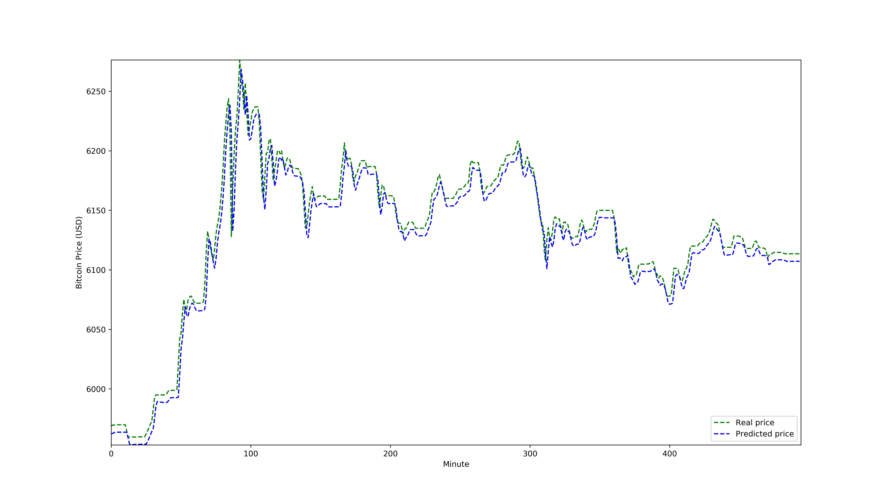

# Bitcoin Price Prediction using Recurrent Neural Networks

Recurrent Neural Networks (RNNs) are a Neural Networks that can be applied as prediction models in sequential data. In particular, time series are sequences of data instances chronologically ordered. One of the fields in which time series analysis is commonly applied is the prediction of the evolution of the price of articles, e.g. in stock market analysis. Bitcoin is the first and most well-known cryptocurrency. This works aims to build a RNN-based model to predict Bitcoin price on a minute-by-minute basis, and analyze its results compared to a simpler, non-RNN model.

The dataset used for the experiments and report, obtained from another GitHub repository, can be found [here](https://github.com/minihat/Crypto-trade-bot/blob/master/BTC_price_history.csv).

| | |
|-|-|
| **Programming language** | Python 3 |
| **Author** | Albert Espín (partially; the code is a modification of Prof. Javier Béjar's [Air Quality prediction](https://github.com/bejar/DLMAI/blob/master/AirQuality/AQPredictionRNN.py)) |
| **Date**  | March 2019  |
| **Report license**  | Creative Commons Attribution, Non-Commercial, Non-Derivative |

